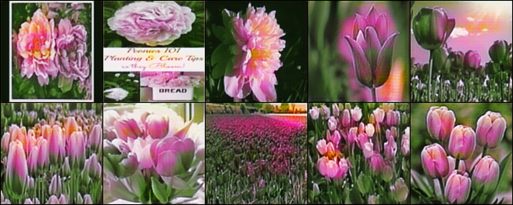
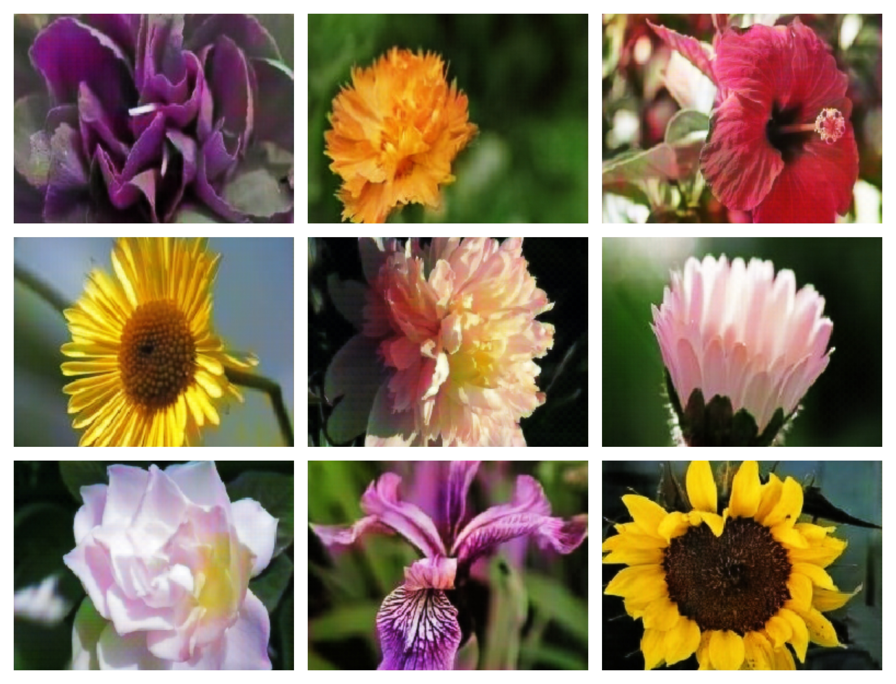

# Pix2Pix
Pix2Pix condistional GAN was implemented for image to image translation in Pytorch framework
## Results

1st row: Target / 2nd row: Input / 3rd row: Generated|
|:---:|
||
||


### Flower dataset
The dataset can be downloaded from Kaggle: [link](https://www.kaggle.com/datasets/aksha05/flower-image-dataset).
To train on larger dataset can be downloaded from kaggle link: [link](https://www.kaggle.com/datasets/l3llff/flowers).

### Face dataset
The dataset can be downloaded from drive link: [link](https://drive.google.com/drive/folders/14uQuTtlR9cTZ9uRFB_E5zaxdnc0i4IL7?usp=sharing).


### Training

#### Sripts
 To train model you can use following comand in your terminalEdit the config.py file to match the setup you want to use. Then run main.py. To train model you can use following comand in your terminal

```
$ python main.py
```

To change the normalisation layers you can go to common.py and change norm_type to instance or batch.
To reload your model and resume training change LOAD_MODEL to True in config.py(make sure ti provide correct model path).
The script creates model_loss.csv to store model losses.

#####Predict

To predict model you can use following comand in your terminal. (Few gray scale images are provided in the test folder)
```
$ python predict.py
```


Note: A sample image convertion to dataset script BW_gen.py is provided please change the code as per the need the current .py file is according to following dataset link [link](https://www.kaggle.com/datasets/l3llff/flowers)
## Pix2Pix paper
### Image-to-Image Translation with Conditional Adversarial Networks by Phillip Isola, Jun-Yan Zhu, Tinghui Zhou, Alexei A. Efros

#### Abstract
Many image processing, computer graphics, and computer vision problems can be solved by "translating" an input image into a similar output image. Despite the fact that the goal is always the same: forecast pixels from pixels, each of these tasks has traditionally been done with its own collection of special-purpose gear. This research proposes a generalized loss function for all image to image translation challenges, such as reconstructing objects from edge maps and colorizing images, among other tasks, to create a common framework for all of these problems. Conditional GAN is the inspiration for this adversarial network. We utilize a convolutional "PatchGAN" classifier as our discriminator, which penalizes structure solely at the scale of image patches. We will be translating the input image (sketched/B&W) into a colored image.


```
@misc{isola2018imagetoimage,
      title={Image-to-Image Translation with Conditional Adversarial Networks}, 
      author={Phillip Isola and Jun-Yan Zhu and Tinghui Zhou and Alexei A. Efros},
      year={2018},
      eprint={1611.07004},
      archivePrefix={arXiv},
      primaryClass={cs.CV}
}
```

